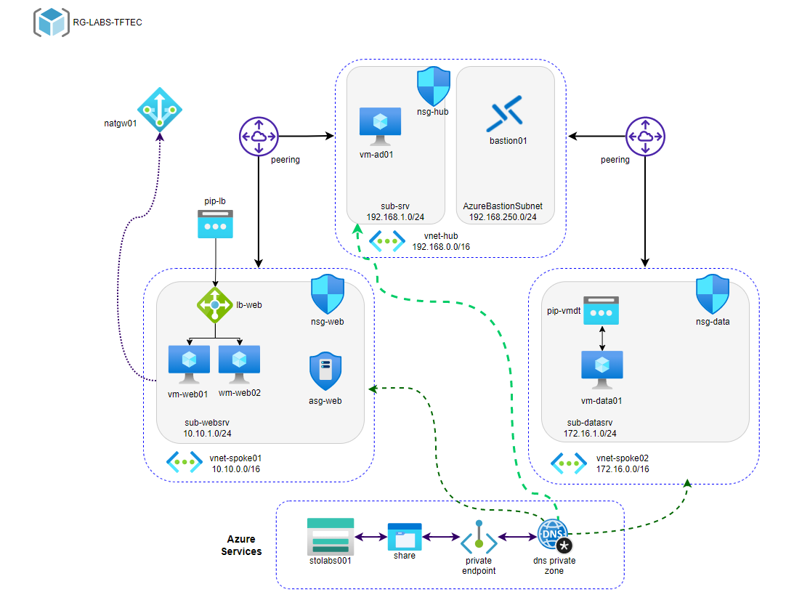

mard# Virtual Network Architecture Summary

The image depicts an advanced virtual network architecture, likely in an Azure environment, with the following key components:

## Resource Group
- **Name**: RG-LABS-TFTEC
- **Description**: Containing all resources.

## Virtual Networks (VNets)
- **vneHrub**: `192.168.0.0/16` - Central hub network.
- **vneH-spoke01**: `10.10.0.0/16` - Spoke network connected to the hub via peering.
- **vneH-spoke02**: `172.16.0.0/16` - Spoke network connected to the hub via peering.

## Subnets
- **sub-srv**: `192.168.1.0/24` - Subnet for services.
- **sub-websrv**: `10.10.1.0/24` - Subnet for web.
- **sub-datasrv**: `172.16.1.0/24` - Subnet for data.
- **AzureBastionSubnet**: `192.168.250.0/24` - Subnet for secure VM access.

## Virtual Machines (VMs)
- **vm-ad01**: Active Directory server.
- **vm-web01**: Web server.
- **svm-web02**: Web server.
- **vm-data01**: Data server.

## Security
- **nsg-web**: Network Security Group for the web subnet.

## Connectivity
- **Peering**: Connection between virtual networks for secure communication.

## Azure Services
- **share**: Services for resource sharing.
- **private endpoint**: Services for private connections.
- **dns private zone**: Services for DNS resolution.

This architecture enables secure and efficient communication between different network components, supporting services such as web, data, and Active Directory.
